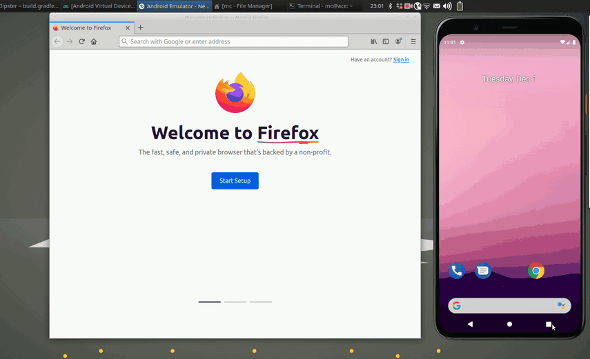

# Clipster - Android Client

Clipster is a multi platform cloud clipboard:  
Copy a text on your smartphone and paste it on your desktop, or vice versa.  
Easy, secure, open source.  
Supports Android, Linux, MacOS and Windows.  
  
This is the Android Client.  
Here is the [Clipster-Desktop](https://github.com/mc51/Clipster-Desktop) client.  
To run your own server check [Clipster-Server](https://github.com/mc51/Clipster-Server).  
  
    

## Setup

Download the latest [clipster.apk](https://github.com/mc51/Clipster-Android/releases/latest/download/clipster.apk) release to your Android device. Make sure you can run third-party apps on your device. Check the "Security" tab or listing within your Settings menu. Normally it’ll say allow third-party installations or install from unknown sources.  

## Usage

On the first run, register a new account. The credentials are saved on your device.  
To share a text in the cloud with your devices, long-press and share it to `Clipster`.  
To get a text that was shared from one of your devices, select `Get Clip`. Then, it is in your local clipboard and you can paste it.

## Planned features

- ~~Encrypt clipboard locally and only transmit encrypted data to server~~
- ~~Add clipboard history~~
- F-Store version
- Google Play Store version
  
## Contributions

Contributions are very welcome. If you come across a bug, please open an issue. The same thing goes for feature requests.

## Credits
  
