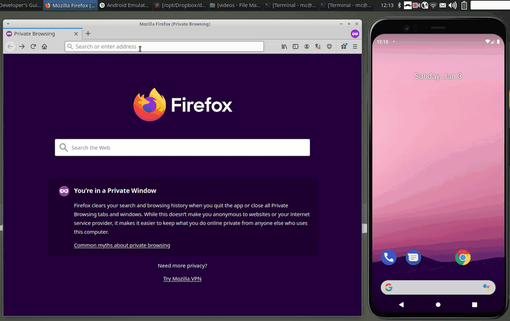

# Clipster - Android Client

Clipster is a multi platform cloud clipboard:  
Copy a text on your smartphone and paste it on your desktop, or vice versa.  
Easy, secure, open source.  
Supports Android, Linux, MacOS, Windows and all browsers.  
  
This is the Android Client.  
There also is a [Clipster-Desktop](https://github.com/mc51/Clipster-Desktop) client for Linux, MacOS and Windows.  
You can run your own [Clipster-Server](https://github.com/mc51/Clipster-Server) on a Linux machine.  
Or you can use the public server at [https://clipster.cc](https://clipster.cc).  
  
  

## Setup

Download the latest [clipster.apk](https://github.com/mc51/Clipster-Android/releases/latest/download/clipster.apk) release to your Android device. Make sure you can run third-party apps on your device. Check the "Security" tab or listing within your Settings menu. Normally it’ll say allow third-party installations or install from unknown sources.  

## Usage

On the first run, register a new account. The (hashed) credentials are saved on your device.  
To share a text with your other devices, long-press and share it to `Clipster` or copy it to the clipboard and `Share Clip` in the app.    
To get a text that was shared from one of your devices, select `Get last Clip` or `Get all Clips` in the app.  

## Roadmap

- [x] Encrypt / Decrypt clipboard locally and only transmit encrypted data to server
- [x] Add clipboard history: share multiple Clips
- [x] Support image sharing
- [ ] F-Store release
- [ ] Google Play Store release
  
## Contributions

Contributions are very welcome. If you come across a bug, please open an issue. The same thing goes for feature requests.
